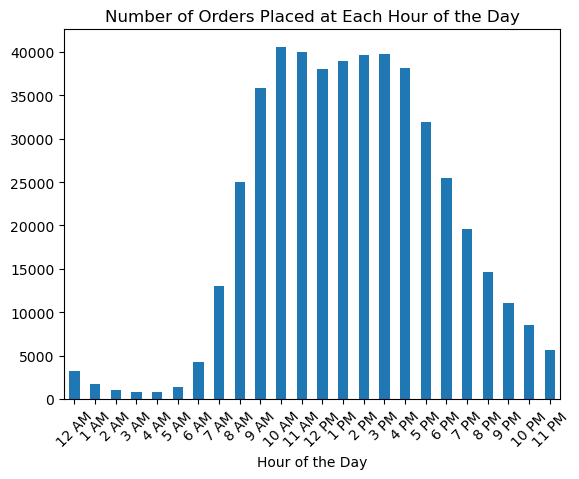
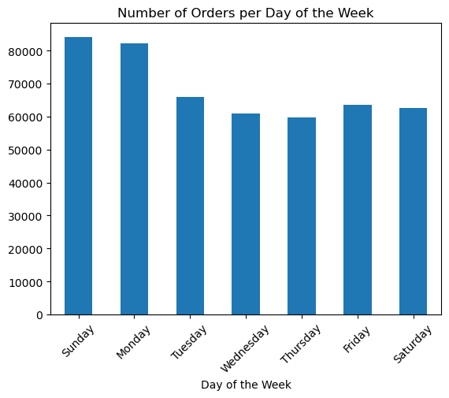
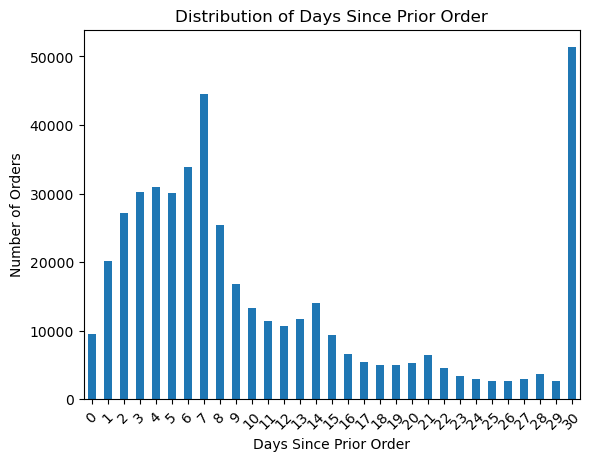
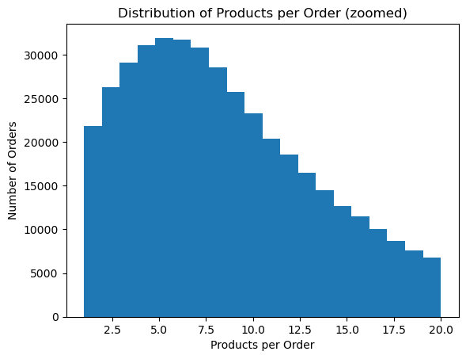

# Instacart Exploratory Data Analysis

## Description

This project aims to explore and analyze an Instacart public dataset, focusing on uncovering insights into customer behavior, product preferences, and order patterns. The notebook titled `Instacart_EDA.ipynb` contains a thorough exploratory data analysis (EDA) that delves into various aspects of the Instacart dataset, including orders, products, aisles, and departments. By examining trends and patterns in this dataset, we address questions related to shopping habits, frequency of purchases, and preferences across different segments of Instacart's product range.

### Table of Contents

[Notebook](Instacart_EDA.ipynb)  
[Data Issues](#data-issues)  
[Insight Highlights](#insight-highlights)  
[Libraries Used](#libraries-used)

### Data Issues

1. 15 duplicate rows in `instacart_orders.csv`. Database Managers may want to investigate.
2. 104 duplicate product names in  `products.csv` with different product IDs. I suspect this is due to the same product being sold in different quantities, but its worth being aware of / looking in to.
3. There are 1,258 missing product names from  `products.csv`. In all cases the associated department ID was 21 (department name recorded as "missing" in `aisles.csv`) and the aisle ID was 100 (also recorded as "missing" in `departments.csv`). I highly recommend the Database Manager look into this.
4. It looks like the 'add to cart order' is correctly collected up to the 64th product added to each order in `order_products.csv`. Any subsequent order is given the NaN value. Developers may want to look into patching this bug.
5. Similarly, 'Days since prior order' in `orders.csv` looks to max out at the 30 day mark (values above 30 are recorded as 30).

### Insight Highlights

1. Volume by hour:  
  
The busiest hour of the day is 10 AM.  
The top five busiest hours of the day are 10 AM, 11 AM, 3 PM, 4 PM, and 1 PM (respectively).
82.17% of all orders are placed between 8AM and 6PM.

2. Volume by day of week:  
  
The volume is highest on Sundays and Mondays, with a relative dip for the rest of the week and a slight uptick on Fridays and Saturdays. I.E. Most volume is done in and around the weekend (Friday - Monday).

3. How long people wait before placing their next order:  
  
Considering point 5 from `Data Issues`, the next most occurring number of days since prior order is 7. Additionally 7 days is the median value for the dataset.  
Generally speaking, customers order about once every 7 days.

4. Item popularity:  
The most ordered products and most reordered products overlap by 95%, with only Organic Grape Tomatoes from the most ordered list being swapped with Organic Grape Tomatoes in the most reordered list. For both most ordered and most reordered, 75% were organic produce.

5. Typical order size:  
  
Typically, people buy 5 items in a single order, as that's the most common order size (mode). The distribution of products per order is right-skewed, with the median at 8 items, slightly higher than the mode. The average (mean) number of items is about 10.

### Libraries Used

Python 3.10.9  
pandas=2.0.3  
numpy=1.25.2  
matplotlib=3.7.1  
